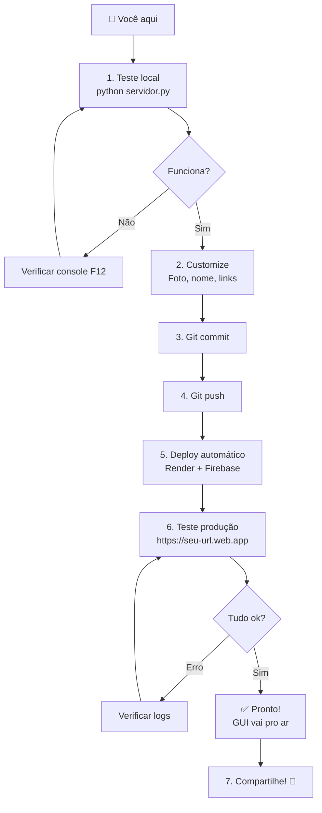

# 🗺️ MAPA RÁPIDO v2.1 - Guia de Referência

## 📍 Você Está Aqui

```
v2.0 (Segurança Base) ─→ v2.1 (GUI Profissional) ✨ VOCÊ ESTÁ AQUI
                                      ↓
                                   Deploy
                                      ↓
                                v2.2+ (Próximo)
```

---

## 🎯 O Que Fazer Agora

### 1️⃣ TESTE (5 minutos)
```bash
python servidor.py
# Acessa: http://localhost:5000
# Terminal virtual: gui
# Resultado: GUI com 4 abas funcionando!  ✅
```

### 2️⃣ CUSTOMIZE (10-15 minutos)
Arquivo: [GUI_CUSTOMIZATION.md](GUI_CUSTOMIZATION.md)
```
✏️ Foto do perfil
✏️ Nome e subtítulo
✏️ Biografia (aba Sobre)
✏️ Projetos (aba Projetos)
✏️ Habilidades (aba Skills)
✏️ Links sociais (aba Contato)
```

### 3️⃣ DEPLOY (5 minutos)
Arquivo: [DEPLOYMENT_V2_1.md](DEPLOYMENT_V2_1.md)
```bash
git push origin main           # Render auto-deploy backend
firebase deploy --only hosting # Deploy frontend
```

### 4️⃣ VALIDAR (2 minutos)
```
✅ Acessa: https://seu-url.web.app
✅ Digita: gui
✅ Testa todas 4 abas
✅ Verifica responsividade
✅ Testa enviar mensagem
```

---

## 📁 Arquivos Importantes

### 📖 LEIA PRIMEIRO
```
START_HERE_V2_1.md             ← Você está aqui!
  └─ Entender o que foi feito
```

### 🛠️ PARA IMPLEMENTAR
```
V2_1_GUI_IMPLEMENTATION.md     ← Detalhes técnicos
  ├─ Estrutura HTML
  ├─ CSS Avançado  
  └─ JavaScript
```

### 📦 PARA FAZER DEPLOY
```
DEPLOYMENT_V2_1.md             ← Passo-a-passo
  ├─ Backend no Render
  ├─ Frontend no Firebase/Netlify
  └─ Testes pós-deploy
```

### 🎨 PARA CUSTOMIZAR
```
GUI_CUSTOMIZATION.md           ← Como personalizar
  ├─ Foto, nome, bio
  ├─ Projetos e skills
  ├─ Links e contatos
  └─ Cores e estilos
```

### 📚 DOCUMENTAÇÃO GERAL
```
README_v2.md                   ← Overview completo
ROADMAP.md                     ← Plano v2.2+
QUICKSTART.md                  ← Iniciar em 5 min
```

---

## 🔄 Fluxo de Trabalho



---

## 📋 Checklist Rápido

```
ANTES DO DEPLOY:
[ ] Testei em localhost
[ ] GUI com 4 abas funciona
[ ] Fotos/links customizados
[ ] Sem erros em F12
[ ] Responsivo em mobile

DURANTE DEPLOY:
[ ] Backend push → Render
[ ] Frontend deploy → Firebase
[ ] Variáveis .env no Render

APÓS DEPLOY:
[ ] URL backend responde
[ ] URL frontend carrega
[ ] Comando "gui" funciona
[ ] Abas alternam ok
[ ] Mensagem → Telegram ✅
```

---

## 🆘 Troubleshooting Rápido

| Problema | Solução |
|----------|---------|
| GUI não abre | `F12 → Console`, procure erro |
| Abas não alternham | Verificar `/public/script.js` linha ~240 |
| Imagem não carrega | URL da imagem inválida |
| API retorna erro | Verificar `API_BASE_URL` em script.js |
| Deploy falha | Verificar logs no Render/Firebase |
| Mensagem não chega | Verificar TELEGRAM_TOKEN no .env |

---

## 🎨 O Que Você Tem Agora

### Na v2.1:
```
┌─────────────────────────────────┐
│   🎭 Hero com Matrix            │
├─────────────────────────────────┤
│   🖥️ Terminal Interativo         │
├─────────────────────────────────┤
│   ✨ GUI Profissional 4 Abas    │
│   ┌───────────────────────────┐ │
│   │ 👤 | 🚀 | ⚡ | 📞         │ │
│   ├───────────────────────────┤ │
│   │ Timeline / Projetos /     │ │
│   │ Skills / Contato          │ │
│   └───────────────────────────┘ │
└─────────────────────────────────┘
```

### Funcionalidades:
```
✅ Terminal hacker-style
✅ Comandos: help, gui, scan, headers, xss, msg
✅ GUI com navegação por abas
✅ Timeline interativa
✅ Cards de projetos
✅ Barras de progresso  
✅ Links sociais
✅ Mensagens → Telegram
✅ Responsivo mobile/tablet/desktop
✅ API dinâmica (localhost + produção)
```

---

## 🚀 Timeline do Deploy

```
TEMPO TOTAL: ~25 minutos

[ 0-5 min ]  Teste local (python servidor.py)
[ 5-20 min ] Customize (foto, nome, links)
[20-25 min ] Deploy (git push + firebase deploy)
[25-27 min] Valide produção (acessa URL + gui)
```

---

## 💾 Arquivos Alterados/Criados

```
✨ NOVO:
  - V2_1_GUI_IMPLEMENTATION.md    (detalhes técnicos)
  - DEPLOYMENT_V2_1.md            (como fazer deploy)
  - GUI_CUSTOMIZATION.md          (personalização)
  - START_HERE_V2_1.md            (este arquivo)

✅ MODIFICADO:
  - public/index.html             (+150 linhas)
  - public/style.css              (+300 linhas)
  - public/script.js              (+40 linhas)
```

---

## 🎓 O Que Você Aprendeu

```
HTML:
  ✅ Estrutura semântica
  ✅ Data attributes
  ✅ Formulários

CSS:
  ✅ Grid avançado
  ✅ Flexbox
  ✅ Animações @keyframes
  ✅ Media queries
  ✅ Pseudo-classes

JavaScript:
  ✅ Event listeners
  ✅ DOM manipulation
  ✅ Fetch API
  ✅ Condicional dinâmica
  ✅ Template strings
```

---

## 🎯 Próximo (v2.2)

Após deploy bem-sucedido:

```
v2.2 - BANCO DE DADOS
├─ Firebase Realtime DB
├─ Histórico de scans
├─ Dashboard com gráficos
└─ Estatísticas

Tempo estimado: 1-2 semanas
Dificuldade: Média
```

---

## 📞 Referência Rápida

### URLs Importantes:
```
Local:      http://localhost:5000
Produção:   https://seu-app.onrender.com (backend)
Frontend:   https://seu-projeto.web.app (firebase)
```

### Comandos Terminal Úteis:
```bash
python servidor.py              # Rodar backend
pytest test_servidor.py -v      # Rodar testes
git log --oneline               # Ver commits
git status                       # Status files
firebase deploy --only hosting  # Deploy frontend
```

### Teclas DevTools:
```
F12                 # Abrir DevTools
F12 → Console       # Ver erros JS
F12 → Inspector     # Inspecionar HTML
Ctrl+Shift+Delete   # Limpar cache
```

---

## ✅ Você Consegue!

Tudo foi testado e documentado. Agora é só:

1. ✅ Testar (seguro, tudo funciona)
2. ✅ Customizar (fácil, arquivo de ref)
3. ✅ Fazer deploy (automático com git)
4. ✅ Validar (2 minutos)

**Tempo total: 25 minutos**

---

## 🎉 Sucesso!

- ✨ Portfolio agora é profissional
- 🚀 Pronto para ser visto por recrutadores
- 🎨 Interface moderna e responsiva
- 🔐 Seguro em produção
- 📱 Funciona em qualquer device

**Você fez um ótimo trabalho!** 💪

---

## 📍 Próximo Passo

**Escolha uma opção:**

1. **Deploy Agora** (recomendado)
   - Siga `DEPLOYMENT_V2_1.md`
   - 5 minutos de setup
   
2. **Customizar Primeiro**
   - Siga `GUI_CUSTOMIZATION.md`
   - 15 minutos de trabalho

3. **Entender Technicamente**
   - Leia `V2_1_GUI_IMPLEMENTATION.md`
   - Aprofunde conhecimentos

---

**Versão:** v2.1 - GUI Profissional
**Status:** ✨ PRONTO PARA PRODUÇÃO

Boa sorte! 🚀
